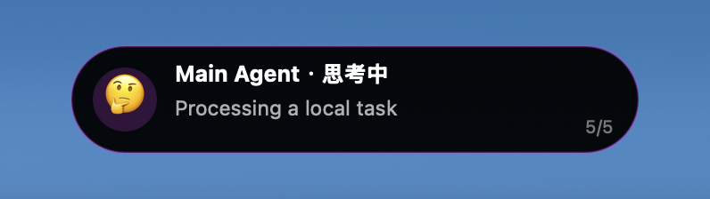

# 小龙虾灵动岛

OpenClaw Dynamic Island



A macOS Dynamic Island companion for OpenClaw. It runs in the background, watches local OpenClaw agent activity, and shows a small top-of-screen status island only when there is active work or a recent completion/failure.

## What It Does

- Shows a compact island with state emoji:
  - `😐` idle
  - `👀` searching / receiving / tool work
  - `🤔` thinking
  - `😊` success
  - `☹️` failure
- Expands automatically when the pointer hovers over the island.
- Stays expanded while the pointer remains over it.
- Switches agents with horizontal trackpad / mouse-wheel gestures.
- Discovers agents from the local OpenClaw config and agent session folders.
- Supports unlimited agents.
- Works across OpenClaw message platforms because it follows OpenClaw agent/session state, not a specific channel:
  - Telegram
  - WeChat
  - Feishu / Lark
  - QQ
  - Discord / Slack / custom gateways, if routed through OpenClaw agents
- Can also accept explicit status updates via `openclaw://update`.
- Installs as a user LaunchAgent so it starts in the background with the macOS login session.

## License

Apache-2.0. See [LICENSE](LICENSE).

## Privacy

This project does not ship with any user configuration, tokens, bot IDs, account IDs, or platform secrets.

At runtime it reads only local OpenClaw metadata from the user's machine:

- `~/.openclaw/openclaw.json`
- `~/.openclaw/agents/<agent-id>/sessions/*.jsonl`

Do not commit your own `~/.openclaw` folder, bot tokens, gateway tokens, or private logs.

## Requirements

- macOS 13+
- Xcode Command Line Tools or Xcode
- OpenClaw installed and configured locally

## Build

```bash
./build.sh
```

The script builds and syncs:

- `Build/OpenClawIsland.app`
- `OpenClawIsland.app`

The root `OpenClawIsland.app` is registered for the `openclaw://` URL scheme.

## Install Background LaunchAgent

```bash
./install-launch-agent.sh
```

This installs:

```text
~/Library/LaunchAgents/com.openclaw.island.plist
```

It keeps the island app running in the background. The island window remains hidden while all agents are idle.

## Agent Discovery

Agents are discovered in this order:

1. `~/.openclaw/openclaw.json` → `agents.list`
2. `~/.openclaw/openclaw.json` → `bindings[].agentId`
3. `~/.openclaw/agents/*` folders
4. fallback `default` agent if nothing is found

Example public-safe OpenClaw config shape:

```json
{
  "agents": {
    "list": [
      { "id": "main", "name": "Main Agent", "avatar": "🤖" },
      { "id": "research", "name": "Research Agent", "avatar": "🔎" },
      { "id": "ops", "name": "Ops Agent", "avatar": "🛠️" }
    ]
  },
  "bindings": [
    {
      "type": "route",
      "agentId": "main",
      "match": {
        "channel": "telegram",
        "accountId": "example-account-id"
      }
    },
    {
      "type": "route",
      "agentId": "research",
      "match": {
        "channel": "weixin"
      }
    }
  ]
}
```

The config above is only an example. Do not publish real account IDs or tokens.

## Explicit Status URL

Any local process can push status:

```bash
open 'openclaw://update?agent=main&state=receiving&msg=Searching%20docs'
open 'openclaw://update?agent=main&state=thinking&msg=Planning%20answer'
open 'openclaw://update?agent=main&state=callingAPI&msg=Calling%20weather%20tool'
open 'openclaw://update?agent=main&state=done&msg=Task%20complete'
open 'openclaw://update?agent=main&state=failed&msg=Tool%20failed'
```

Supported query parameters:

| Parameter | Description |
| --- | --- |
| `agent` / `agentId` / `id` | OpenClaw agent ID |
| `state` | `idle`, `receiving`, `thinking`, `callingAPI`, `done`, `failed`, `playingMusic` |
| `msg` / `message` / `detail` | Status detail |
| `name` | Optional display name |
| `avatar` | Optional display avatar |

## Interaction

| Action | Result |
| --- | --- |
| Hover pointer over island | Expand details |
| Move pointer away | Collapse |
| Horizontal trackpad / mouse-wheel gesture | Switch to previous/next agent |
| Long press | Local demo workflow |

Horizontal gestures are rate-limited so one continuous swipe switches only one agent. After a short cooldown, another swipe can switch again without moving the pointer away.

## OpenClaw Skill Package

This repository includes a root `SKILL.md`. It describes the desktop companion and can be copied into an OpenClaw skill registry or installed as a local skill entry, while the app itself remains the executable component.

This is a hybrid package:

- `SKILL.md` documents the capability for OpenClaw/Codex-style agents.
- `OpenClawIsland.app` is the native macOS runtime.
- `install-launch-agent.sh` makes the runtime always available in the background.

## Development

```bash
./build.sh
open ./OpenClawIsland.app
```

State snapshot for debugging:

```bash
cat /tmp/openclawisland-state.json | python3 -m json.tool
```

## Release Checklist

- Ensure `Build/` and `*.app` are not committed.
- Ensure `.openclaw/`, `.env*`, logs, and local configs are not committed.
- Use public example IDs only.
- Choose a license before publishing.
